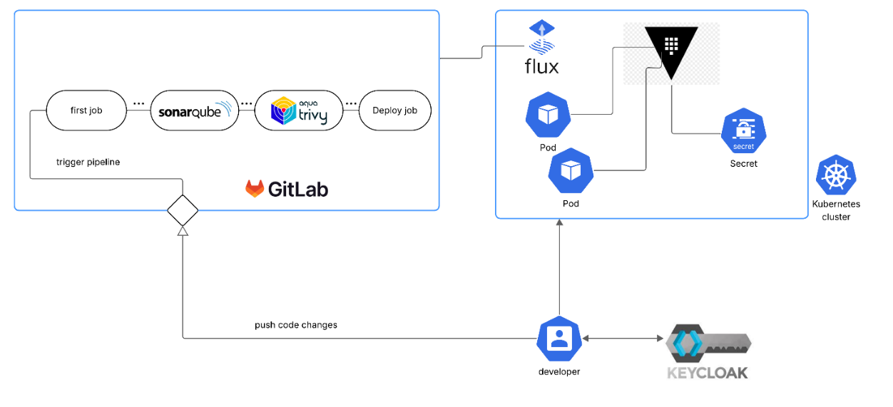

# Secure Cloud-Native Platform: A DevSecOps Approach

This project demonstrates a secure, end-to-end, cloud-native platform built on Kubernetes. It is designed to embed security into every phase of the software development lifecycle (SDLC), from developer identity and code creation to production deployment and runtime secrets management.

The architecture integrates a suite of best-in-class tools to address the primary pillars of DevSecOps:

1. **Platform & Identity Security:** Centralized, OIDC-based authentication for all platform users.
2. **Application & Secret Security:** Dynamic, ephemeral credentials for applications at runtime.
3. **CI/CD & GitOps Security:** A "shift-left" scanning pipeline and a secure pull-based deployment model.

## Core DevSecOps Architecture

The platform's security model is built on three foundational pillars that decouple responsibilities and enforce the principle of least privilege.

### 1. Platform & Identity Security (Keycloak)

User access to the Kubernetes clusters is not managed with static `kubeconfig` files, which are insecure and difficult to audit.

- **Centralized Authentication:** **Keycloak** is used as the central Identity Provider (IdP).
- **OIDC Integration:** The RKE2 Kubernetes API server is configured to authenticate users via the **OpenID Connect (OIDC)** protocol.
- **Secure `kubectl` Access:** Developers and operators use `kubectl` by authenticating against Keycloak, which issues short-lived, auditable tokens. Access is granted based on centralized group memberships, not individual static credentials.

### 2. Application & Secret Security (HashiCorp Vault)

Application secrets (database passwords, API keys) are eliminated from Git repositories, CI/CD variables, and Docker images.

- **Centralized Secrets Management:** **HashiCorp Vault** serves as the single source of truth for all secrets, providing encryption-at-rest and detailed audit logs.
- **Dynamic Secrets (Gold Standard):** For critical services like databases, the platform uses the **Vault Agent Injector**.
    1. Applications request database credentials on startup.
    2. Vault dynamically generates a *new, unique* username/password for that specific pod with a short Time-To-Live (TTL).
    3. The agent injects these credentials into the pod's filesystem.
    4. The sidecar agent automatically renews the credential lease and revokes it when the pod is terminated.
- **Static Secrets (GitOps Pattern):** For applications that must consume native Kubernetes `Secret` objects (e.g., third-party Helm charts), the **Vault Secrets Operator** is used. It securely synchronizes static secrets from Vault into the cluster as Kubernetes `Secret` objects, keeping them out of Git.

### 3. Deployment & GitOps Security (FluxCD)

The platform uses a secure, pull-based **GitOps** model, which creates a critical separation of concerns between the CI and CD processes.

- **CI Role (Build & Push):** The GitLab CI pipeline's *only* role is to build, test, scan, and push a trusted container image to the registry.
- **GitOps Handover:** The CI pipeline **does not** have administrative credentials to the Kubernetes cluster. Its final job is to commit an image tag update to a separate, dedicated GitOps repository.
- **CD Role (Pull & Reconcile):** **FluxCD** runs inside the Kubernetes cluster. It continuously monitors the GitOps repository. When it detects the new image tag commit, *it* pulls the change and applies it to the cluster, managing the entire deployment. This is inherently more secure and provides a full audit trail for every change.

## The Secure CI/CD Pipeline (Shift-Left)

The GitLab CI pipeline is a multi-stage workflow that provides progressively deeper security validation. It is intelligently configured as a "monorepo" to only run jobs relevant to the code that changed (backend or frontend).

### Pipeline 1: Draft Merge Request (Fast Feedback)

- **Trigger:** Developer opens a **Draft** Merge Request.
- **Goal:** Provide the fastest possible feedback on basic errors and critical security flaws.
- **Key Jobs:**
    - `secret-detection`: (Fail-Fast) Uses **Gitleaks** to scan for hardcoded secrets. Fails immediately if any are found.
    - `validate-and-build`: Compiles the code (Maven/NPM) and runs dependency analysis.
    - `backend-unit-tests`: Runs fast unit tests to check business logic and generates a JaCoCo code coverage report.

### Pipeline 2: Active Merge Request (Security Gate)

- **Trigger:** Developer marks the Merge Request as **"Ready"**.
- **Goal:** Perform a deep security and quality analysis to ensure code is safe to merge into `main`.
- **Key Jobs:** (Runs all jobs from Pipeline 1, plus)
    - `sonarqube-backend`: (SAST) Pushes code to **SonarQube** for deep Static Application Security Testing (SAST) and quality analysis. The pipeline fails if the defined **Quality Gate** (e.g., "No new Critical vulnerabilities") is not met.
    - `trivy-filesystem-scan`: (SCA) Uses **Trivy** to scan `pom.xml` and `package.json` for known vulnerabilities in third-party dependencies *before* they are built into an image.
    - `backend-integration-tests`: Runs integration tests to ensure new changes do not break existing component interactions.

### Pipeline 3: Main Branch (Build & Deploy)

- **Trigger:** The Merge Request is approved and **merged into the `main` branch**.
- **Goal:** Build the final, trusted container images, perform a final artifact scan, and trigger the GitOps deployment to staging.
- **Key Jobs:** (Runs all jobs from Pipeline 2, plus)
    - `docker-build-backend`/`frontend`: Packages the application into immutable container images using Docker and **Kaniko**. Images are tagged with the unique commit SHA and pushed to the GitLab Container Registry.
    - `trivy-scan-backend-image`: (Container Scan) This is a critical second scan. Trivy inspects the *final container image* for vulnerabilities in its base OS and all system libraries.
    - `deploy-staging`: (GitOps Handover) Clones the separate GitOps repository, uses `yq` to update the image tag in the Kubernetes manifests, and pushes the change, triggering FluxCD to deploy.

## Technology Stack

| **Domain** | **Tool** | **Purpose** |
| --- | --- | --- |
| **Platform** | **RKE2** | Security-hardened, CNCF-certified Kubernetes distribution. |
| **CI/CD & GitOps** | **GitLab CI** | Source Code Management (SCM) and CI pipeline orchestration. |
|  | **FluxCD** | The in-cluster GitOps operator for pull-based deployments. |
| **Security** | **HashiCorp Vault** | Centralized static and dynamic secrets management. |
|  | **Keycloak** | Identity & Access Management (IAM) provider for OIDC authentication. |
|  | **SonarQube** | Static Application Security Testing (SAST) and code quality gate. |
|  | **Trivy** | Software Composition Analysis (SCA) and Container Image Scanning. |
|  | **Gitleaks** | Secret detection in source code. |
| **Application** | **Java 21 & Spring Boot** | Backend microservice. |
|  | **Angular & Node.js** | Frontend application. |
| **Containerization** | **Docker / Kaniko** | Building container images. |

## Future Improvements

This project lays a strong foundation. Future work to further mature the platform includes:

- **Software Supply Chain Security:** Implementing **Sigstore/Cosign** for cryptographic signing and verification of container images.
- **Runtime Security:** Integrating **Falco** for real-time threat detection and automated response.
- **Network Security:** Adding a service mesh like **Istio** to enforce mutual TLS (mTLS) for all in-cluster communication.
- **Advanced Testing:** Completing the pipeline with **Cypress** for End-to-End (E2E) tests and **OWASP ZAP** for Dynamic Application Security Testing (DAST).

## Important Note: Repository Scope

**NB:** This repository contains the **application source code** (backend and frontend) and the **DevSecOps CI/CD pipeline** (`.gitlab-ci.yml`) responsible for testing, scanning, and building the application.

The setup and configuration of the underlying platform infrastructure (such as the RKE2 cluster, HashiCorp Vault, FluxCD, and SonarQube) are managed in a separate **GitOps infrastructure repository**. The Keycloak instance, which provides OIDC authentication, was installed and configured manually.
